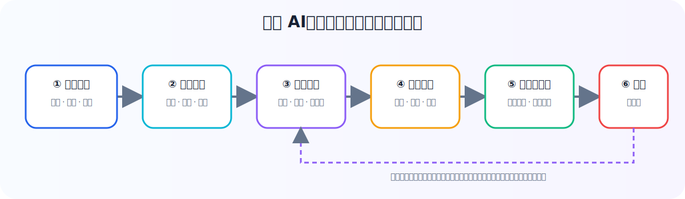
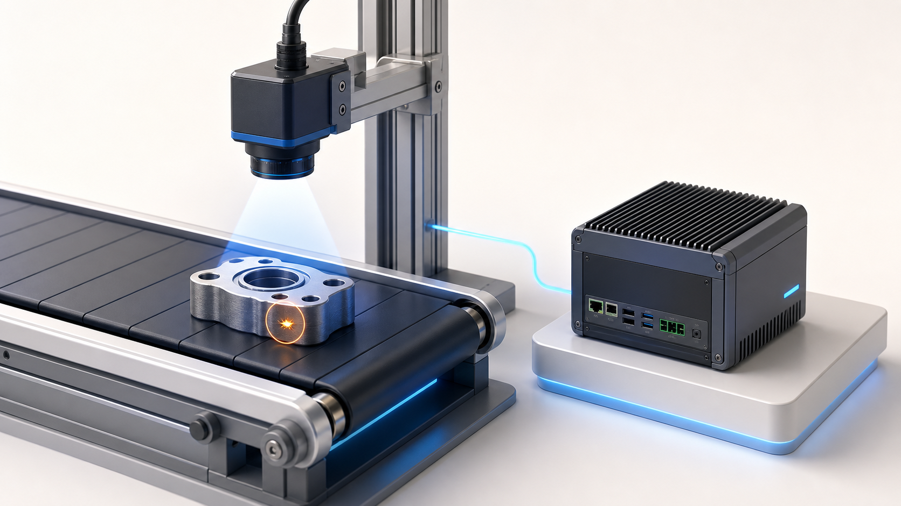

# 工业算法入门 · GitHub 导览

  

  <strong>从一个现场问题开始，走到一个可交付的工业 AI 闭环。</strong> 
  <a href="../index.html">打开图文课程</a> · <a href="../README.md">阅读课程说明</a> · <a href="../06_算法与资讯雷达.html">查看前沿雷达</a>

---

## 一条学习主线

  

## 课程地图

| 章节 | 解决什么问题 | 入口 |
| --- | --- | --- |
| 01 · 神经网络 | 模型为什么能学、又为什么会学错？ | [开始学习](../01_从零看懂神经网络.html) |
| 02 · 视觉模型 | 相机怎样发现划痕、缺件和异常？ | [查看视觉](../02_视觉模型入门.html) |
| 03 · 时序与表格 | 振动、温度、能耗如何提前预警？ | [查看时序](../03_时序与表格模型入门.html) |
| 04 · 五大场景 | 哪些场景最适合先做工业 AI？ | [查看场景](../04_工业AI五大场景实战.html) |
| 05 · 产线落地 | 怎样部署、监控并让模型持续有效？ | [查看交付](../05_从模型到产线落地.html) |
| 06 · 前沿雷达 | 新模型、新论文和开源项目怎么判断？ | [查看雷达](../06_算法与资讯雷达.html) |

## 看图不迷路

<table>
  <tr>
    <td width="50%" align="center">
       
      <strong>机器视觉</strong> 
      相机看见问题，模型判断问题，规则决定怎么处理。
    </td>
    <td width="50%" align="center">
       
      <strong>预测性维护</strong> 
      传感器捕捉早期变化，模型在设备真正停机前发出预警。
    </td>
  </tr>
</table>

## 技术图规范

仓库中的 `diagram/` 保存了可缩放 SVG。它们统一遵循：

- 一个图只讲一条主线；
- 箭头只走水平或垂直方向，避免交叉；
- 卡片之间预留安全间距，避免文字和节点重叠；
- 场景插画负责建立直觉，SVG 负责讲清算法关系。

## 推荐使用方式

1. 在 GitHub 中先阅读本页，快速建立课程全貌。
2. 点击任一章节链接，使用浏览器打开对应的图文课程。
3. 需要二次制作或汇报时，优先复用 `diagram/` 中的 SVG，而不是截图。

> 工业 AI 的起点不是“上一个大模型”，而是找到一个数据拿得到、指标说得清、人工愿意复核的小问题。
